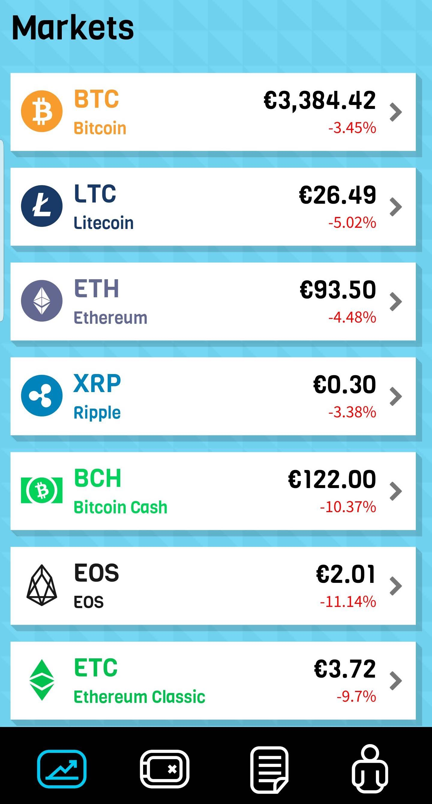

# Event-driven microservices met Spring Webflux
Microservice architecturen kunnen aan de ene kant veel voordelen opleveren, maar kunnen ook complex zijn om te implementeren en onderhouden.
In dit artikel bespreken we hoe we omgaan met de complexiteiten van microservices door gebruik te maken van event driven communicatie en de reactive benadering van Spring Webflux.   


## Microservice communicatie
Een gedistribueerde microservices architectuur heeft als voordeel dat de verschillende services onafhankelijk van elkaar gewijzigd
en gedeployed kunnen worden. Hierdoor is de impact van een deployment laag en kunnen features snel worden gerealiseerd en uitgerold.
Dit verhoogt weer de mogelijkheid om te experimenteren met verschillende features en oplossingen. Een tweede voordeel is dat de services
onafhankelijk van elkaar kunnen schalen. Uiteraard zijn er ook uitdagingen, bijvoorbeeld op het gebied van communicatie en data consistentie. 
Hoe zorg je ervoor dat de juiste informatie bij de juiste services aankomt? Welke data verteld me de echte waarheid over de state van mijn systeem?
Een geaccepteerde oplossing hiervoor is om gebruik te maken van een 'append-only' event-log. Hierbij gebeurt alle communicatie doormiddel van het schrijven van een 
event naar de event-log. De verschillende services kunnen zich abonneren op deze event-log en de voor hun interessante events verwerken. De event-log bevat de absolute 
waarheid met betrekking tot de state van de applicatie. Services hebben hier een afgeleide view op. Deze afgeleide views zijn 'eventual consistent', het duurt even voordat de events
verwerkt zijn in de specifieke services. Deze 'eventual consistent' view biedt weer uitdaging als we de resultaten van onze actie aan de gebruiker willen tonen.
Wij hebben deze architectuur toegepast bij de realisatie van een platform voor het handelen in cryptocurrency met de naam 'We Are Blox' (1).

## Applicatie
De 'We Are Blox' app maakt het mogelijk om eenvoudig te handelen in verschillende cryptocurrency. De gebruiker maakt een account aan (of logt in met een social media account), verifieert een ID bewijs doormiddel van het opsturen van een foto,
kan geld storten met iDeal / credit card / etc. en kan dit geld vervolgens gebruiken om een portfolio op te bouwen van BTC, ETH, XRP of andere crypto munten. Uiteraard is het mogelijk om de investeringen weer te verkopen terug te voorkopen en de Euro's
uit te keren naar een eigen bankrekening (Figuur 1).  


Figuur 1


## Architectuur & Technologie: CQRS, ES & Reactive
Zoals gezegd is de communicatie tussen de services gebaseerd op een event log. In principe consumeren de services elkaars events zonder dat ze weten waar deze events vandaan komen of naar toe gaan. Ze publiceren de events op een eventbus. De eventbus 
slaat vervolgens berichten op (append only) en publiceert deze naar alle event handlers. Een eventhandler kan gezien worden als een abonnement op een specifiek event. Dit is de enige manier waarop services onderling communiceren. 
De gebruikers interactie met het platform gaat via een mobiele applicatie. We hebben ervoor gekozen om de communicatie tussen de mobiele applicatie en de server backend op de traditionale manier via REST te laten verlopen. Zoals bekend is, is REST
in essentie een synchroon protocol. Als we kijken naar de functionaliteit, is het voor de gebruikers het fijnst als ze direct feedback krijgen op hun acties. Om dit te realiseren maken we gebruik van een REST facade die synchrone calls vertaalt naar
onze asynchrone backend.


Figuur 2

De REST facade stuurt specifieke berichten naar de services, dit zijn Commands voor mutaties en Queries voor lees operaties. Het gebruik van deze berichten is gebaseerd van CQRS. Voor de REST facade maken we gebruik van Spring Webflux, het reactieve zusje
van Spring Web. Voor CQRS maken we gebruik van Axon Framework. De eventbus en eventstore worden geimplementeerd door 1 opensource product, AxonServer (2). Deze kan dus zowel events opslaan als doorsturen naar de consumerende services.

Aangezien de events voor ons de absolute waarheid zijn, moeten we deze events gebruiken voor het bepalen van de state van onze applicatie. Elk muterend Command wordt gevalideerd tegen de huidige state, de state wordt opgebouwd door de events af te spelen
en toe te passen op een aggregate. Dit pattern heet Event Sourcing (3).

## Voorbeeld: het genereren van quotes
Voordat een gebruiker crypto currency kan kopen of verkopen, moet deze een prijs aanvragen, dit noemen we een quote. Bij deze actie wil de gebruiker direct resultaat zien op het scherm (Figuur 3).
 

Figuur 3

De code van de REST facade voor deze functie is te vinden in Listing 1.

```java
@RequestMapping(value = "/quote",produces = {"application/json;charset=UTF-8"},method = RequestMethod.POST)
public Mono<ResponseEntity<QuoteResponse>> createQuote(@Valid @RequestBody QuoteRequest quoteRequest) {
    String quoteId = UUID.randomUUID().toString(); //1

    Flux<FindQuoteResponse> quoteResponseFlux = this.queryGateway
        .subscriptionQuery(new FindQuoteQuery(quoteId), FindQuoteResponse.class, FindQuoteResponse.class)
        .updates(); //2
    
    this.commandGateway.send(translator.createQuoteCommand(quoteId, quoteRequest)); //3

    return quoteResponseFlux
        .filter(response -> response.getQuoteEntry() != null)
        .timeout(Duration.ofMillis(timoutMillis))
        .next()
        .map(this::validateQuote)
        .map(translator::convertFoundQuoteToQuoteResponse)
        .map(quoteResponse -> ResponseEntity.ok().body(quoteResponse))
        .onErrorReturn(ResponseEntity.status(HttpStatus.SERVICE_UNAVAILABLE).build())
        .defaultIfEmpty(ResponseEntity.status(HttpStatus.SERVICE_UNAVAILABLE).build()); //4
}

```
Listing 1

We genereren eerst een uniek ID voor de quote die we gaan aanmaken (regel 1). Vervolgens gebruiken we Project Reactor om een subscriptie aan te maken op updates van deze 
quote. Dit doen we door een FindQuoteQuery te versturen over de Axon query bus. In dit geval geven we aan dat het om een subscriptionQuery gaat. De response hiervan is 
van type Flux<FindQuoteResponse> (regel 2). Flux is het datatype wat aangeeft dat er 0 of meer objecten over tijd kunnen arriveren. Als de Quote Service de quote gegenereerd 
heeft wordt deze verstuurd via de query gateway en ontvangen we hem aan deze kant. Om dit proces te starten sturen we een CreateQuoteCommand (regel 3). Deze operatie is ook asynchroon. 
Het laatste statement van deze methode is een reactive chain. Laten we hier doorheen lopen om te bekijken wat er precies gebeurd. Allereerst gebruiken we 'filter' om
alleen de responses door te laten die gevuld zijn. De 'filter' operatie heeft als argument een functie die een boolean teruggeeft. Hierna specificeren we een 'timeout'. 
De subscription query is een remote call, dus er kan van alles misgaan, inclusief dat we geen antwoord terug ontvangen. Mochten we een leeg antwoord terugkrijgen, dan laat ons
filter geen items door. Om te voorkomen dat onze REST controller geen antwoord teruggeeft gebruiken we de timeout operatie, na de gespecificeerde timeout geeft deze een exceptie.
We zijn maar geinteresseerd in 1 quote, 'next' is de operatie die ons het eerst volgende item teruggeeft. Deze transformeert de Flux (0 of meer) naar een Mono (0 of 1).
We gebruiken de map operatie om te valideren en te converteren naar een QuoteResponse en uiteindelijk een ResponseEntity. Tot slot hebben we nog twee operaties voor Exception
handling, zowel in het geval van een error of een lege waare geven we een HTTP status service unavailable terug (regel 4).

  
Listing 2 toont de ontvangende kant van de CreateQuote command waarin de quote wordt opgehaald van het externe systeem wat de markt data beheert. De call naar 
dit systeem wordt gedaan door de methode "requestQuoteFromTradingEngine" (regel 1). Deze aanroep doen we binnen de 'flatMap' operatie. We gebruiken 'flatMap' omdat de requestQuoteFromTradingEngine zelf asynchroon is en een Mono teruggeeft. 
Een tweede voordeel van de 'flatMap' is dat we een retry kunnen doen om het moment dat er een fout optreedt. Als requestQuoteFromTradingEngine een exceptie gooit, dan wordt de 'retryWhen' operator aangeroepen. De 'retryWhen' operator is een variant op 'retry'.
De standaard 'retry' resubscribed altijd in het geval van een Exceptie. In dit geval houdt dat in dat de code in de 'flatMap' opnieuw wordt uitgevoerd. Aan retryWhen kun je een publisher meegeven die 0 of 1 waarde teruggeeft (of een Exceptie). 
In dit geval gebruiken we de reactor-extra library (4) om exponential backoff (5) toe te passen. Hierdoor kunnen we met een steeds grotere delay de externe functie opnieuw aanroepen. Ook kunnen we een maximum aantal retries meegeven. Als de externe aanroep
blijft falen wordt er een exceptie gegooid. In het geval van een valide response sturen we een SuccessEvent, in het geval van een Exceptie een FailureEvent. Beide worden opgeslagen in onze Event Store, zodat we deze later kunnen afhandelen.

```java
@CommandHandler
public void createQuote(CreateQuoteCommand command) {
    Mono.just("")
        .flatMap(a ->
            requestQuoteFromTradingEngine(command) //1
                .flatMap(
                    quote -> {
                        eventBus.publish(asEventMessage(translator.createSuccessEvent(quote, command.getQuoteId())));
                        return Mono.empty();
                    })
        ).retryWhen(Retry.any().exponentialBackoff(Duration.ofMillis(initialBackoff), Duration.ofMillis(maxBackoff)).retryMax(retryMax)) //2
        .doOnError(error -> eventBus.publish(asEventMessage(translator.createFailureEvent(command, error))))
        .subscribe();
}
```
Listing 2

Listing 3 toont de event handling kant waarin het resultaat wordt opgeslagen in een relationele database. Ook versturen we dit opgeslagen resultaat via de queryUpdateEmitter naar alle subscribers van de query (zie listing 1). Bij het versturen van dit resultaat
is het mogelijk om een conditie mee te geven die bepaalt welke subscribers het resultaat ontvangen. Aan de subscribe kant (listing 1 regel 2) geven we een quote ID mee. Aan de versturende kant versturen we alleen een resultaat naar een subscriber met hetzelfde ID.

```java
@EventHandler
public void onSuccess(QuoteRequestSuccessEvent event) {
    QuoteEntry quoteEntry = createSuccessQuoteEntryFromEvent(event);
    entityManager.persist(quoteEntry);
    this.queryUpdateEmitter.emit(FindQuoteQuery.class, query -> quoteEntry.getQuoteId().equals(query.getQuoteId()), new FindQuoteResponse(quoteEntry));
  }

@EventHandler
public void onFailure(QuoteRequestFailureEvent event) {   
    QuoteEntry quoteEntry = createFailureQuoteEntryFromEvent(event);
    entityManager.persist(quoteEntry);
    this.queryUpdateEmitter.emit(FindQuoteQuery.class, query -> quoteEntry.getQuoteId().equals(query.getQuoteId()), new FindQuoteResponse(quoteEntry));
}

```
Listing 3

## Uitdagingen
Uiteraard zijn er ook uitdagingen verbonden aan deze manier van werken. Ten eerste zijn veel libraries nog niet reactive of zelfs niet asynchroon. Toen we het project begonnen was bijvoorbeeld Spring Security 5 nog niet volledig geimplementeerd op het gebied van OAuth. Verder 
maakt zowel het Axon Framework als Swagger (code generatie op basis van api specificaties) nog veelvuldig gebruik van Completable Futures. Deze zijn overigens eenvoudig om te zetten naar een Mono (Mono#toFuture & Mono.fromFuture).
Unit tests vereisen ook enige aanpassing. Het helpt als de code die je test netjes een Flux (of Mono) teruggeeft. In de test heb je dan de mogelijkheid om hier op te subscriben (Flux#subscribe) of te blocken (Flux#blockFirst / Flux#blockLast). 
Door te blocken wordt de code weer synchroon en wordt er gewacht op het eerste of laaste resultaat. Voor het in detail testen van reactive chains kun je gebruik maken van de StepVerifier (6). Spring Webflux controllers kun je testen met WebTestClient(7).
Step through debugging is niet echt mogelijk, omdat je dan het opbouwen van de reactive chain debugged. Eventueel kun je een breakpoint zetten in een lambda statement. Het is ook mogelijk om de logging expressiever te maken. Listing 4 toont het gebruik van de 'log' operator,
deze zorgt ervoor dat elke operatie aanroep wordt gelogd. Ook kun je gebruik maken van de 'doOnXXX' operators. Deze operators zijn specifiek bedoelt voor het operaties met side effects, zoals logging. Er is bijvoorbeeld een doOnError en een doOnEach.
 

```java
return quoteResponseFlux.log()
        .filter(response -> response.getQuoteEntry() != null)
        .timeout(Duration.ofMillis(timoutMillis))
        ...
```
Listing 4

## Conclusie
De asynchrone eigenschappen van werken met events en remote messaging zorgen doorgaans voor uitdagingen bij het schrijven van code. Als je je beperkt tot de standaard Java 8 API, zul je gebruik moeten maken van Runnables, callbacks en/of CompletableFutures. Door het toevoegen
van Project Reactor als library krijg kun je gebruik maken van Reactive Programming. Hiermee wordt asynchrone code een stuk leesbaarder en heb je uitgebreide mogelijkheden voor bijvoorbeeld retries en error handling.
De uitdagingen zitten vooral in het gebruik van niet asynchrone libraries, testen en debugging. 

## Referenties
1) https://www.weareblox.com
2) https://axoniq.io/download
3) https://microservices.io/patterns/data/event-sourcing.html
4) https://github.com/reactor/reactor-addons
5) https://en.wikipedia.org/wiki/Exponential_backoff
6) https://projectreactor.io/docs/test/release/api/reactor/test/StepVerifier.html
7) https://docs.spring.io/spring-framework/docs/current/javadoc-api/org/springframework/test/web/reactive/server/WebTestClient.html
